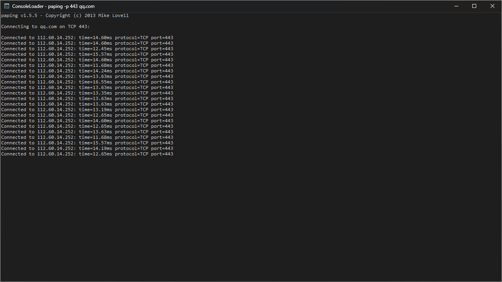

# ConsoleLoader
Load all console app into GUI. 

Compile: (MSYS2 UCRT64)

`windres ConsoleLoader.rc -O coff -o ConsoleLoader_res.o`

`g++ -std=c++17 -O2 -pipe -municode ConsoleLoader.cpp ConsoleLoader_res.o -o ConsoleLoader.exe -static-libstdc++ -static-libgcc -lole32 -luuid -lcomctl32 -ldwmapi -lgdi32`
